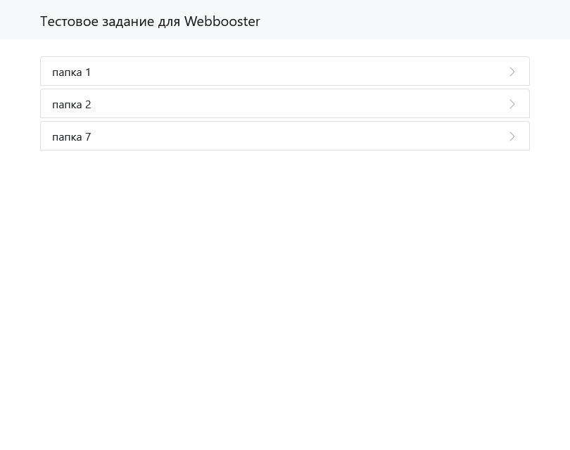
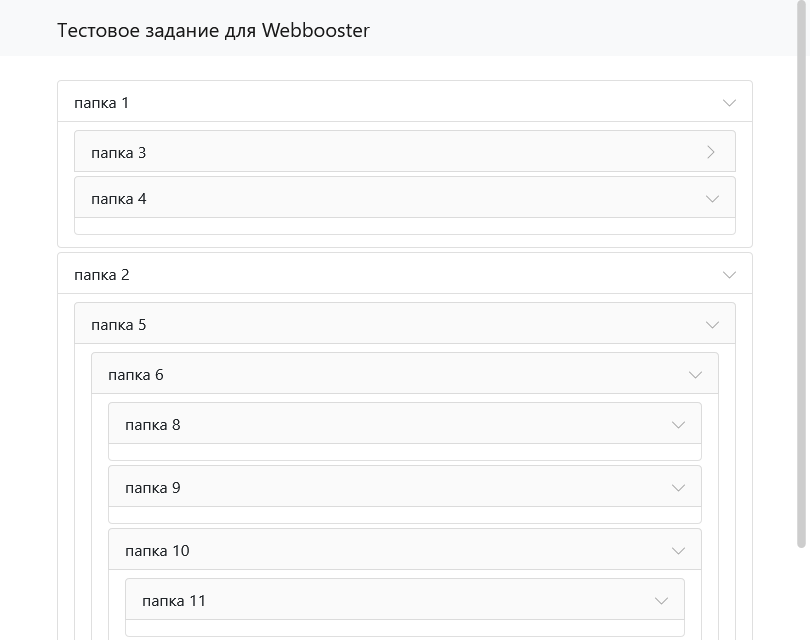

# WebBoosterTest

Тестовое задание для WebBooster. Описание тестового слишком маленькое, я не совсем понял что можно использовать, а что нет, поэтому сделал так как делаю это обычно (как писал в резюме). Если нужно по другому, отпишите пожалуйста на почту, без проблем переделаю.

Стиль для выделения вложенных папок серым находится в App/Views/Index.phtml: 22 строка

Javascript который сворачивает/разворачивает каталог идёт уже готовый от bootstrap (также могу написать сам на чистом js, если нужно)

